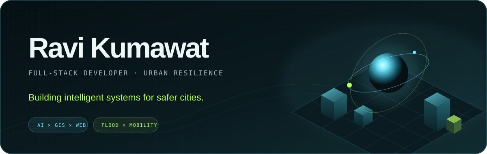
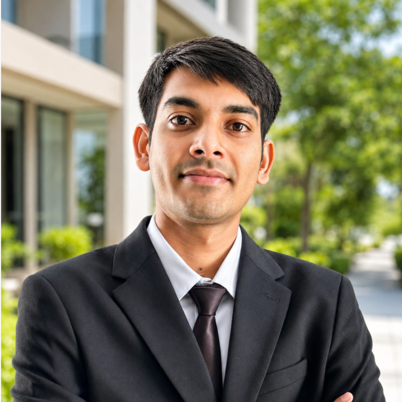

  

  
  
  

<table>
  <tr>
    <td width="68%" valign="top">
      <h2>About me</h2>
      
I am <strong>Er Ravi Kumawat</strong>, a BTech graduate from <strong>IIT Gandhinagar</strong> and a <strong>Software Engineer</strong> at <strong>AIResQ Climsols Pvt. Ltd.</strong>

      
I build technology for <strong>urban resilience</strong>, especially flood prediction, traffic analysis, geospatial applications, and smart mobility systems.

      
I worked with <strong>MIR Lab</strong> on a mobility platform that brings flood-risk prediction and traffic data together to support safer and more efficient routes during extreme conditions.

      <pre>Current focus → Climate resilience · Mobility intelligence
I like to     → Model the problem · Build the system · Make it useful</pre>
    </td>
    <td width="32%" align="center" valign="middle">
       
      <strong>Software Engineer · India</strong>
    </td>
  </tr>
</table>

## Engineering system map

  

## Animated technology constellation

  

## What I am building toward

|  | Direction | Purpose |
|:---:|---|---|
| 🌊 | **Urban flood intelligence** | Turn complex environmental data into information that people and city systems can use. |
| 🧭 | **Safer route intelligence** | Combine risk and traffic signals to support navigation during extreme conditions. |
| ⚙️ | **Software engineering systems** | Connect responsive interfaces, APIs, data stores, AI workflows, and cloud infrastructure into dependable products. |

## Contribution game

  <picture>
    <source media="(prefers-color-scheme: dark)" srcset="https://raw.githubusercontent.com/Ravi22110219/ravi22110219/output/github-contribution-grid-snake-dark.svg" />
    <source media="(prefers-color-scheme: light)" srcset="https://raw.githubusercontent.com/Ravi22110219/ravi22110219/output/github-contribution-grid-snake.svg" />
    
  </picture>

## GitHub activity

  

  <strong>Have an idea in climate, mobility, AI, or software engineering?</strong> 
  <a href="mailto:ravi.kumawat@iitgn.ac.in">Let's start a conversation.</a>

